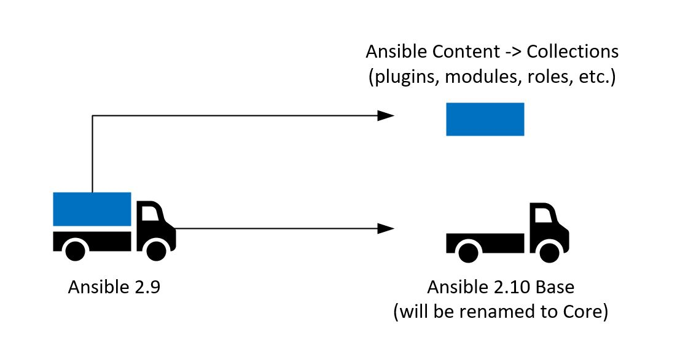

# Ansible Collections
Compiled by Waldemar Baldowski (2021-04-14)

## Legal notice and copyright
- The following materials are modeled on or entirely derived from the external documentation listed in the "Reference materials" section.
- Labs scenarios were created by author.

## Introduction
A little bit of history about Ansible project and content management ...  
 

### Previously: Ansible 2.9 and earlier
- Single development repository ansible/ansible.
- Single package called Ansible.
- Ansible had major releases twice a year, every 6 months.
- New features went into the next major release.
- Module creators had to wait for their modules to be included in an upcoming release.
- Or had to add them to roles, which made consumption and content management more difficult.
- Managing entire product life cycle with so many components was inefficient and slow.

### Now: Ansible 2.10 and later
- The ansible/ansible (ansible-base) repository only contains:
    - The core Ansible programs, ansible-{playbook,galaxy,doc,test,etc} and documentation.
    - A tiny subset of modules and plugins required for controller functionality.
    - Together are known as ansible-base.
- The rest of the modules and plugins have been moved into various collections.
- Ansible Collections:
    - Can be released independently of ansible-base, at whatever release cycle the collection maintainer prefers.
    - May use their own git repo with dedicated backlog and product life cycle.    

### Terminology
- Classic Ansible: 
    - Ansible prior 2020, version 2.9 and earlier versions. 

- Collection: 
    - A tarball package for bundling and distributing Ansible content in standardized way: plugins, roles, modules.
    - Can be released independent of other collections or ansible-base, so features can be made available sooner to the users.
    - Installed via: ansible-galaxy collection install <namespace.collection>.

- ansible (the package):
    - A replacement software package (python, deb, rpm) which contains a select group of collections.
    - It contains the collections to ensure that Ansible 2.9 playbooks do not require any extra collections to be be installed.
    - Will depend on the ansible-base package.

- ansible-base (the package):
    - New for 2.10. The codebase that is now contained in github.com/ansible/ansible for the Ansible 2.10 release.
    - It contains a minimal amount of modules and plugins and allows other collections to be installed.
    - Similar to Ansible 2.9 though without any content that has since moved into a collection.
    - Ansible Base in 2.10 to be renamed to Ansible Core in 2.11.

- Ansible Galaxy:
    - An online hub for finding and sharing Ansible community content. 
    - Also, the command-line utility that lets users install individual Ansible Collections.

- Fully Qualified Collection Name (FQCN):
    - The full definition of a module, plugin, or role hosted within a collection, in the form <namespace.collection.content_name>.
    - The FQCN is required when you want to specify the exact source of a module and multiple modules with the same name are available.
    - In cases in which users have multiple collections installed with similar content, the FQCN will always be the explicit and authoritative indicator of which collection to use for content.
    - Example: cisco.ios.ios_config would be the FQCN, and the playbook would generally call "ios_config" module.
    - Prevent name collisions.

- Namespace:
    - The first part of a Fully Qualified Collection Name. 
    - The namespace usually reflects a functional content category. Example: in cisco.ios.ios_config, “Cisco” is the Namespace.
    - Namespaces are reserved and distributed by Red Hat at Red Hat’s discretion.
    - Many, but not all, namespaces will correspond with vendor names.

- Collection name:
    - In the second part of a Fully Qualified Collection Name, the collection name further divides the functional characteristics of the collection content and denotes ownership.
    - For example, the cisco namespace might contain cisco.ios, cisco.ios_community, containing content for managing ios network devices maintained by Cisco.

- community.general (collection):
    - A special collection managed by the Ansible Community Team, containing all the modules and plugins which shipped in Ansible 2.9 that don't have their own dedicated Collection. See community.general on [Galaxy](https://galaxy.ansible.com/community/general) or it's [GitHub repository](https://github.com/ansible-collections/community.general/).

- community.network (collection):
    - Similar to community.general, though focusing on Network modules.
    - See community.network on [Galaxy](https://galaxy.ansible.com/community/network) or it's [GitHub repository](https://github.com/ansible-collections/community.network/).

## Collection directory structure

- **galaxy.yml**: Source data for the MANIFEST.json that will be part of the collection package 
- **README.md**: Main documentation page 
- **docs/**: Detailed documentation 
- **meta/**: Metadata files including runtime.yml (for redirection rules, compatibility, deprecation) 
- **playbooks/**: Playbook snippets 
    - **tasks/**: Holds 'task list files' for include_tasks/import_tasks usage 
- **plugins/**: All Ansible plugins, each in its own subfolder 
    - **modules/**: Module plugins (aka “modules”) 
    - **lookups/**: Lookup plugins 
    - **filters/**: Jinja2 filter plugins 
    - **connection/**: Connection plugins required if defaults not used 
- **roles/**: Ansible roles 
- **tests/**: The sanity, unit and integration tests 

## Where did modules or plugins go (to collections)?
- The redirection/mapping of content that was once in 2.9 and migrated out to collections:
- URL: https://github.com/ansible/ansible/blob/devel/lib/ansible/config/ansible_builtin_runtime.yml 

## Labs with detailed usage examples
- :[Lab 1 - Environment setup](labs/LAB1.md)

- :[Lab 2 - Managing collections](labs/LAB2.md)

- :[Lab 3 - Using collections](labs/LAB3.md)

- :[Lab 4 - Custom collection demo](labs/LAB4.md)

## Reference materials
- https://github.com/ansible-collections/overview/blob/main/README.rst  
- https://docs.ansible.com/ansible/latest/user_guide/collections_using.html#collections
- https://www.ansible.com/blog/installing-and-using-collections-on-ansible-tower 
- https://www.ansible.com/blog/getting-started-with-ansible-collections
